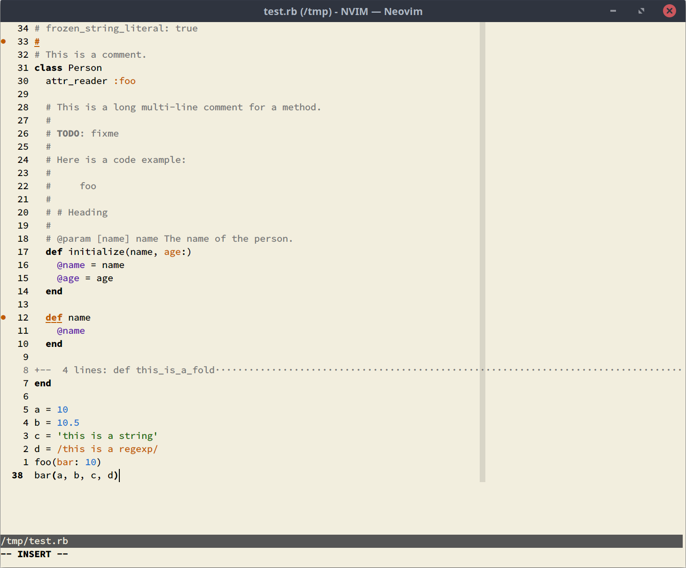
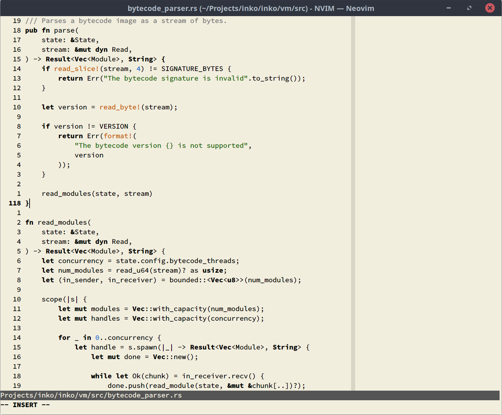
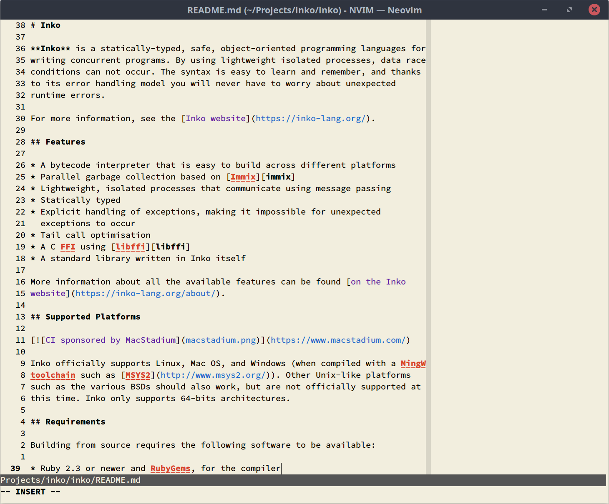

# Nvim Paper

Vim paper for Neovim! See original colorscheme made by [yorickpeterse](https://gitlab.com/yorickpeterse) in the Related projects section.

(Neo)Vim Paper is based on the color of paper as found in various notebooks.

Dark themes are not necessarily a good choice for your eyes,
and research has shown that it's generally better to have dark text on a light
background (see [this StackExchange question for some interesting
data](https://ux.stackexchange.com/questions/53264/dark-or-white-color-theme-is-better-for-the-eyes)).
In addition, [halation](https://en.wiktionary.org/wiki/halation) becomes a
problem when presenting light text on (very) dark backgrounds.

Please note that this theme is designed with the following display properties in
mind:

- An LCD/TFT display
- A display temperature range of 4000K-5200K
- A low display brightness

## Screenshots

| Ruby                          | Rust                          | Markdown                              |
| :---------------------------- | :---------------------------- | :------------------------------------ |
|  |  |  |

## Requirements

- NeoVim 0.7.0 or newer (due to the use of `nvim_set_hl()`)
- true-color support

For best results use `set laststatus=3` (introduced in NeoVim 0.8), as the theme
is designed with this setting in mind.

## Installation

### Vim Plug

    Plug 'https://github.com/nvim-paper.git'

Then run `PlugInstall` to install it, followed by `color paper` to enable the
theme.

## Terminal colors

If you want to use Paper as your terminal theme, you can use the following color
palette:

| Color  | Normal    | Bright    | GNOME Terminal color index |
| :----- | :-------- | :-------- | :------------------------- |
| Black  | `#000000` | `#555555` | 0, 8                       |
| Red    | `#CC3E28` | `#CC3E28` | 1, 9                       |
| Green  | `#216609` | `#216609` | 2, 10                      |
| Yellow | `#B58900` | `#B58900` | 3, 11                      |
| Blue   | `#1E6FCC` | `#1E6FCC` | 4, 12                      |
| Purple | `#5C21A5` | `#5C21A5` | 5, 13                      |
| Cyan   | `#158c86` | `#158c86` | 6, 14                      |
| White  | `#AAAAAA` | `#AAAAAA` | 7, 15                      |

For the text color, highlight color, etc, use:

| Color     | Foreground | Background |
| :-------- | :--------- | :--------- |
| Text      | `#000000`  | `#F2EEDE`  |
| Highlight | `#000000`  | `#D8D5C7`  |

## Related projects

- https://gitlab.com/yorickpeterse/vim-paper
- https://gitlab.com/samue1/paper-theme: support for bashtop, iTerm, Vieb, and
  Vifm
- https://marketplace.visualstudio.com/items?itemName=18kimn.notebook-theme:
  support for VS Code

## License

All source code in this repository is licensed under the Mozilla Public License
version 2.0, unless stated otherwise. A copy of this license can be found in the
file "LICENSE".
